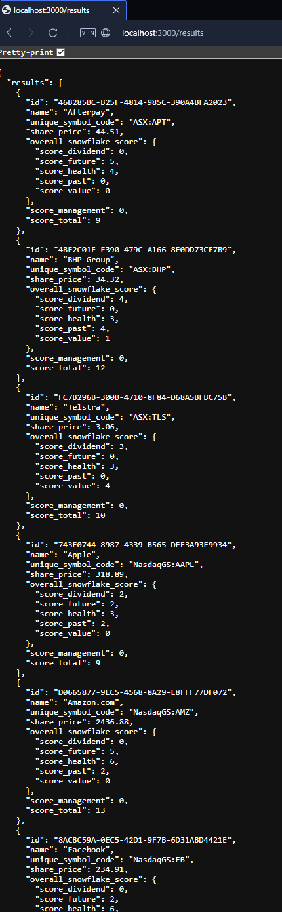
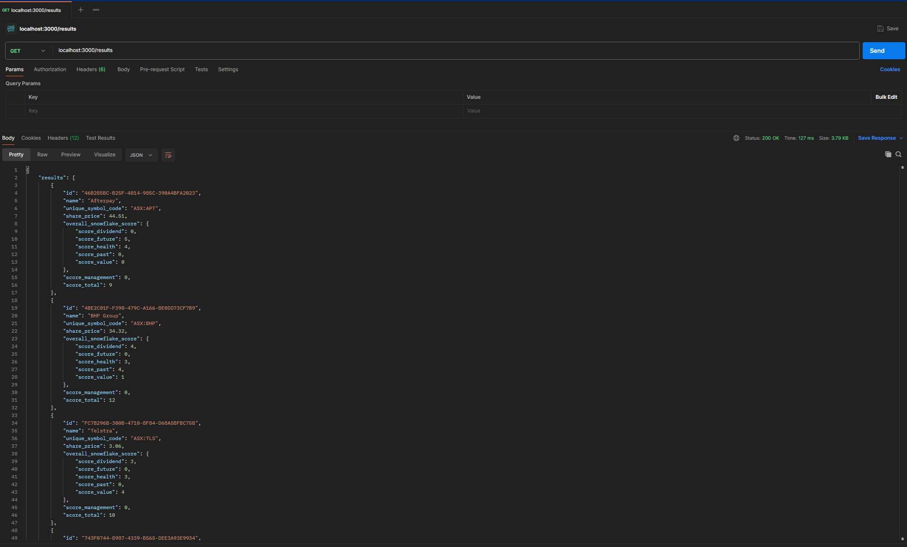
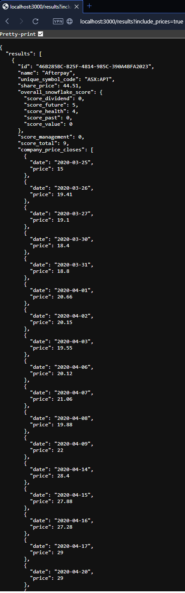
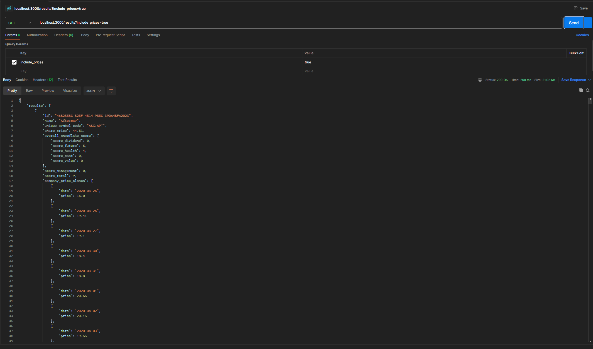
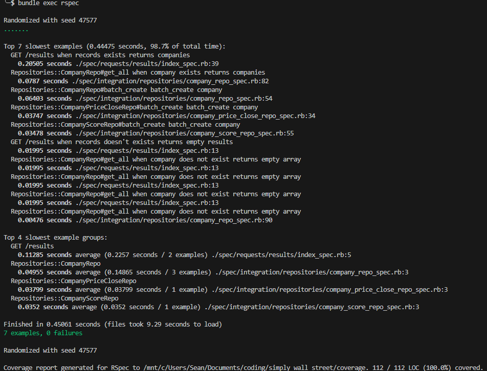

# README

### Setup

You'll first need to install Ruby 3.3.4. We recommend doing so using [rbenv](https://github.com/rbenv/rbenv).

once you have ruby, use `bin/setup` to start installing the app. You might encounter some errors.
If so, don't worry. Just try to resolve them, then run `bin/setup` again.
Keep going until the script runs successfully.

If you are using windows like me it would be better for you to follow step 1-3 of this guide that I found on [Reddit](https://pagertree.com/blog/getting-started-with-ruby-on-rails-in-2024-the-complete-development-environment-guide): https://pagertree.com/blog/getting-started-with-ruby-on-rails-in-2024-the-complete-development-environment-guide
It is possible for you to follow the rest of the steps but I only did the first 3 steps before using rbenv.

### Running
To run the app, use `rails s`. You can access the app by visiting `localhost:3000` in your browser or postman.

### Application
To access the application for this task, all you need is to visit `localhost:3000/results` in your browser or postman.

you should be able to see results like the images below depending on if you passed the optional parameter.

No Parameters:

With Optional Parameter:

### Testing
For test, the system used for is rspec.
Run `bundle exec rspec` to run the test spec, after the test spec was ran you would be able to see something like the image below.

This project also use [simplecov](https://github.com/simplecov-ruby/simplecov) to check for the code coverage of the test to view it simply run either `open coverage/index.html` for mac terminal or `xdg-open coverage/index.html` for debain/ubuntu terminal
if those don't work then you would need to open the file in the browser manually.

### Issues and workaround.
Database migration issue: [database migration issue](docs/database_migration_issue.md)